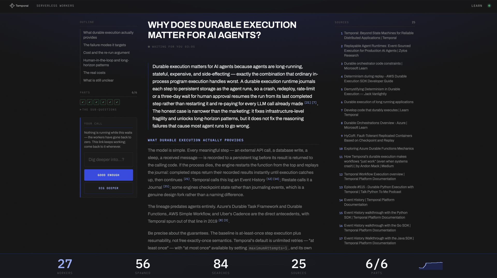
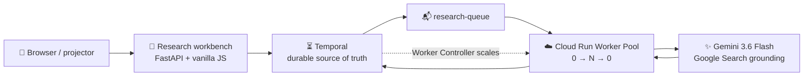
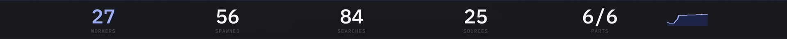
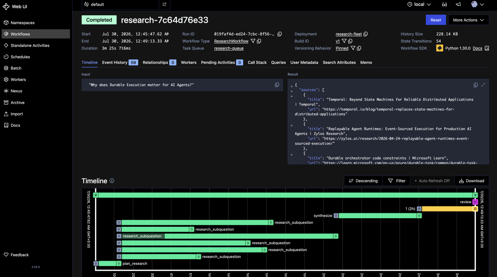
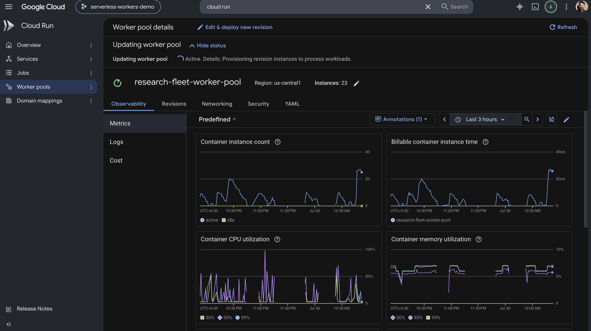

<div align="center">

[](https://temporal.io)
[](https://cloud.google.com/run/docs/workerpools)
[](https://ai.google.dev/gemini-api/docs)
[](#test-it)
[](LICENSE)

</div>

# Durable Research Fleet — Gemini Edition

**Ask once. Watch a fleet appear, research in parallel, and disappear — while the Workflow stays alive.**

A conference-ready deep-research demo powered by **Temporal Serverless Workers**, **Google Cloud Run**, and **Gemini with Google Search grounding**.

One question becomes up to six independent research jobs. Each job maps to one Cloud Run Worker, the pool scales `0 → N → 0`, and Temporal preserves the plan, findings, report, and human-review pause throughout.

> **🎬 See the story:** ask from the workbench, watch Serverless Workers climb in the sticky footer, review the cited draft, then approve it after the pool has returned to zero.



### ✨ Key demo moments

| Moment | What happens | Why it matters |
|---|---|---|
| 🔀 **Research fan-out** | One question becomes ~6 independent sub-questions | Parallel work creates real Task Queue backlog |
| 🚀 **Workers from zero** | Cloud Run adds one-slot Workers to meet that backlog | The fleet is created for the work, not kept warm |
| 🔎 **Grounded research** | Gemini researches with server-side Google Search | Findings return with sources instead of unsupported prose |
| ⏸️ **Durable review** | The Workflow parks with a finished draft and no active task | State survives without an app server or database holding the request open |
| ⚡ **Wake from zero** | Accept or refine sends a Temporal Signal | A live Workflow wakes even after the Worker Pool has scaled away |

> **Last live infrastructure verification — August 15, 2026:** 16/16 deployment checks passed. Five queued smoke-test Workflows took the Worker Pool from **0 to 4 instances in 20 seconds**. The smoke test uses no Gemini tokens.

## 🏗 Why this architecture?

> **Traditional approach:** one long-running app process owns the request. If it dies mid-research, orchestration state and completed work need to be reconstructed.
>
> **This approach:** Temporal owns the durable execution. Cloud Run Workers are disposable compute. A replacement Worker can continue from event history without rerunning sibling research that already finished.



There is no application database. The workbench is a projection of the Workflow's `progress` Query; the durable state lives in Temporal event history.

## The proof on screen

The outline sits on the left, the cited report in the middle, sources on the right, and live fleet counters along the bottom. When the draft is ready, `WAITING FOR YOU` appears with the review card.



Temporal shows six `research_subquestion` Activities overlapping, followed by synthesis and a timer ended early by the human-review Signal:



Cloud Run shows the same story from the infrastructure side:



## 5-minute local quickstart

The infrastructure path needs neither GCP nor a Gemini key.

```bash
git clone <your-fork-url> durable-research-fleet-gemini
cd durable-research-fleet-gemini
python3 -m venv .venv
.venv/bin/pip install -r requirements-dev.txt
```

Run these in separate terminals:

```bash
# 1 — Temporal dev server; Web UI at http://localhost:8233
temporal server start-dev

# 2 — versioned local Worker
.venv/bin/python worker_local.py

# 3 — one-time, AFTER the Worker begins polling
temporal worker deployment set-current-version \
  --deployment-name research-fleet --build-id local --yes

# 4 — one Workflow, then a five-Workflow burst
.venv/bin/python starter.py --watch
.venv/bin/python starter.py --count 5 --watch
```

Step 3 is required: every Workflow declares a versioning behavior, so Temporal rejects its Workflow Tasks when the Worker is not in versioned mode.

### Run the Gemini research app

Create a `GEMINI_API_KEY` in [Google AI Studio](https://aistudio.google.com/apikey), place it in the gitignored `.env`, then restart the Worker with local-only parallelism:

```bash
set -a; . ./.env; set +a
MAX_CONCURRENT_ACTIVITIES=6 .venv/bin/python worker_local.py
make web-local
```

Open **http://localhost:8000**. One run uses one planning call, up to six grounded research calls, and one synthesis call. A refine decision may trigger one additional bounded fan-out.

The higher slot count is only for local development. Keep the deployed value at `1`: one Activity slot per instance is what turns a six-way fan-out into a visible Serverless Worker fleet.

## Deploy to GCP

You need a GCP project, `gcloud`, Docker, Terraform, and a Gemini key. `PROJECT` must be set explicitly unless you own the repository's default demo project.

```bash
export GEMINI_API_KEY=your-key

make up AUTO=1 PROJECT=your-project-id
make register-queues PROJECT=your-project-id
make verify SCALE=1 PROJECT=your-project-id
```

That sequence builds the unreleased Temporal CLI needed for the Cloud Run provider, creates the GCP stack, seeds Secret Manager without putting the key in Terraform state, registers the Task Queues, and proves scale-from-zero.

> **Serverless Workers is Pre-release.** The Cloud Run provider is not in a released Temporal CLI/server. `make cli` builds the required main-branch CLI with the upstream Cloud Run field-mask fix pinned in, and Terraform ships it to the VM.

### Open the deployed workbench

The Cloud Run web Service is intentionally **internal-only**. Opening its `run.app` URL from a public browser should fail; that is the security boundary, not a broken deployment.

Serve the same workbench locally while it drives the real deployed Temporal and Cloud Run fleet:

```bash
# Terminal 1 — leave running
make tunnel PROJECT=your-project-id

# Terminal 2
make web-local
```

Then open **http://localhost:8000**. If port `7233` is already occupied, use:

```bash
make tunnel PROJECT=your-project-id LOCAL_FRONTEND_PORT=7433
TEMPORAL_ADDRESS=localhost:7433 make web-local
```

The deployed shape is:

| Layer | GCP resource | Behavior |
|---|---|---|
| Temporal | Compute Engine VM | Private frontend at `10.10.0.10:7233`; runs the prerelease Worker Controller |
| Research fleet | Cloud Run Worker Pool | Manual count controlled by Temporal; normally zero when idle |
| Web tier | Cloud Run Service | Internal ingress and authenticated invocation only |
| Model key | Secret Manager | Mounted into Workers; never passed through Terraform state |
| Worker image | Artifact Registry | One image with Worker and web entrypoints |

After rebuilding the image with the same tag, force the Worker Pool onto the new digest; Cloud Run pins image digests per revision. See [AGENTS.md](AGENTS.md) gate #14 for the exact command and the other deployment invariants.

## How the Workflow runs

```text
plan → fan out research → synthesize → wait for review → accept or refine
```

- `HelloWorkflow` is the token-free infrastructure smoke test. Its five-second Activity creates the backlog used to verify scaling.
- `ResearchWorkflow` is the real application. It plans, fans out, synthesizes, pauses for review, and optionally performs one refinement round.
- `runtime.py` is app-agnostic infrastructure. Both applications plug into its versioned Worker seam.
- `llm.py` is the Gemini seam. Temporal is the only retry layer; Google Search is a built-in server tool.

## Configuration

Local defaults target `temporal server start-dev`.

| Variable | Default | Purpose |
|---|---|---|
| `TEMPORAL_ADDRESS` | `localhost:7233` | Temporal frontend address |
| `TEMPORAL_API_KEY` | unset | Temporal Cloud credential; setting it enables TLS |
| `TEMPORAL_DEPLOYMENT_NAME` | `research-fleet` | Versioned Worker Deployment name |
| `MAX_CONCURRENT_ACTIVITIES` | `1` | Activity slots per Worker; raising this hides deployed scaling |
| `MAX_SUBQUESTIONS` | `6` | Fan-out width and approximate Worker count per question |
| `RESEARCH_EFFORT` | `medium` | Gemini thinking level: `minimal`, `low`, `medium`, or `high` |
| `GEMINI_MODEL` | `gemini-3.6-flash` | Model selected without rebuilding the image |
| `GEMINI_API_KEY` | unset | Required only when a research Activity first calls Gemini |
| `DEMO_PASSCODE` | unset | Guards both asking and refinement actions in the web tier |

## Test it

```bash
make test
```

The suite is offline: **105 Python tests + 10 Terraform contract tests**. Gemini calls use fakes and never spend tokens.

For the live infrastructure gate:

```bash
make verify SCALE=1 PROJECT=your-project-id
```

## Repository map

| Path | Role |
|---|---|
| `runtime.py` | Connection, versioned Worker, slot limits, unique identity, graceful shutdown |
| `workflows.py` · `activities.py` | Token-free infrastructure smoke test |
| `llm.py` | Gemini + Google Search boundary, isolated from Temporal |
| `research_*.py` | Plan, parallel research, synthesis, review, and transport types |
| `web.py` · `web/` | Responsive workbench; FastAPI and vanilla JS, no build step |
| `terraform/` | Complete private GCP stack |
| `tests/` | Workflow, replay, web-security, provider, and infrastructure contracts |
| `learn/` · `docs/` | In-app learning cards, runnable tutorial, and research knowledge base |

For the manual walkthrough, see [docs/TUTORIAL.md](docs/TUTORIAL.md). For the platform research and design rationale, see [docs/KNOWLEDGE_BASE.md](docs/KNOWLEDGE_BASE.md).

## License

Apache-2.0 — see [LICENSE](LICENSE). Copyright 2026 Temporal Technologies, Inc.

Bundled fonts are redistributed under the SIL Open Font License (`web/fonts/LICENSE-*.txt`). The Temporal wordmark in `web/temporal-logo.svg` is a trademark of Temporal Technologies, included for this demo and not covered by Apache-2.0.

---

This Gemini edition is a provider port of the original [Durable Research Fleet](https://github.com/temporal-community/durable-research-fleet), created by [Shubham Londhe (@LondheShubham153)](https://github.com/LondheShubham153).
