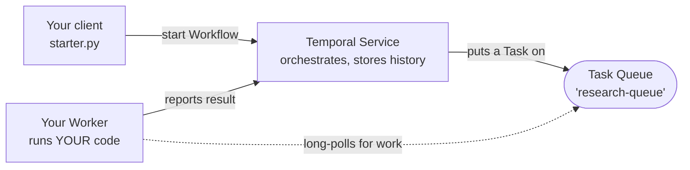
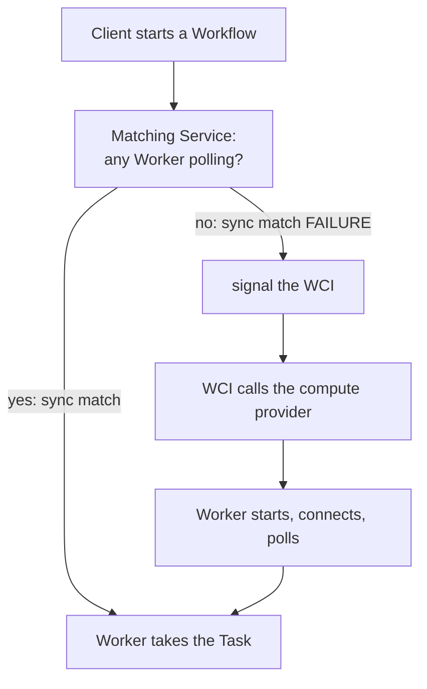

# Learn: Temporal → Serverless Workers on Cloud Run

Eleven cards, a couple of minutes each. **Click one to open it.**

📘 = from Temporal's docs, linked. 🔬 = measured in this repo, *not* in the docs —
sometimes contradicting them.

> [!NOTE]
> Serverless Workers are **Pre-release**, and the Cloud Run provider isn't in a
> released CLI or server yet. Cards 9 and 10 describe something working — verified
> 2026-07-28 — but expect the API to move.

---

<details>
<summary><b>1 · Why Temporal exists</b> — 🟢</summary>

Charge a card, reserve stock, email a receipt. Step 2 crashes. Now you need retry
logic, somewhere to persist "step 1 already happened", idempotency, a retry timer,
and a way to resume after a deploy. That code is where the bugs live — and you
rewrite it for every process.

Temporal's alternative is **Durable Execution**: it records every step. If the
process dies, a different one resumes from the last recorded step, same variables,
same line. You write the happy path; Temporal supplies the memory.

📘 [Understanding Temporal](https://docs.temporal.io/evaluate/understanding-temporal)

<details><summary>✅ Check yourself</summary>

**Q.** Your process is killed between step 1 and step 2. What makes step 2 happen?

**A.** Step 1's result is in the Workflow's Event History. Temporal hands the Workflow
to another Worker, which replays that history to reach the same state, then continues.
The card is not charged twice.

</details>
</details>

---

<details>
<summary><b>2 · Workflows and Activities</b> — 🟢</summary>

| | Workflow | Activity |
|---|---|---|
| Job | Orchestration — order, branching, waiting | One unit of real work |
| Must be | **Deterministic** (it gets replayed) | Anything you like |
| Example | "charge, then reserve, then email" | the HTTP call, the DB write, the LLM call |
| On failure | Replayed from history | Retried on its own policy |

Determinism is the rule that trips people up. A Workflow is re-executed from the top
whenever it resumes, so it must reach the same decisions every time. `random()`,
`now()`, and network calls don't — so they belong in an Activity.

Here: [`workflows.py`](../workflows.py) is orchestration,
[`activities.py`](../activities.py) is the thing that takes time.

📘 [Workflows](https://docs.temporal.io/workflows) · [Activities](https://docs.temporal.io/activities)

<details><summary>✅ Check yourself</summary>

**Q.** Why can't a Workflow call `requests.get()` directly?

**A.** On replay it would call again and might get a different answer, so the Workflow
could branch differently than history records — a non-determinism error. In an Activity,
the *result* is recorded once and replayed thereafter.

</details>
</details>

---

<details>
<summary><b>3 · Task Queues and Workers</b> — 🟢</summary>

The most clarifying fact about Temporal's architecture: 📘 *"The Temporal Service
(including the Temporal Cloud) doesn't execute any of your code… on Temporal Service
machines."* It orchestrates state and hands out Tasks. Your Worker runs your code.



Note the dotted arrow's direction — the Service never connects *to* your Worker; the
Worker reaches out. That's why a Worker needs no inbound port and can sit behind a
firewall. A **Task Queue** is just a name both sides agree on; you create one by
using it.

📘 [Workers](https://docs.temporal.io/workers) · [Task Queues](https://docs.temporal.io/task-queue)

<details><summary>✅ Check yourself</summary>

**Q.** Temporal Cloud is running your Workflow. Whose machine executes your Activity?

**A.** Yours. Which is also why Cloud can't see your secrets.

</details>
</details>

---

<details>
<summary><b>4 · Run one locally</b> — 🟢 · hands-on</summary>

From the repo root, with [the Temporal CLI](https://docs.temporal.io/cli):

```bash
python3 -m venv .venv && .venv/bin/pip install -r requirements.txt
```

```bash
temporal server start-dev                      # terminal 1 — UI on :8233
```

```bash
temporal worker deployment set-current-version \
    --deployment-name research-fleet --build-id local --yes
.venv/bin/python worker_local.py               # terminal 2
```

```bash
.venv/bin/python starter.py Shubham --watch    # terminal 3 → ~5.3s
```

Open http://localhost:8233 and read the Event History — every arrow from Card 3 is a
row in it.

> [!TIP]
> **Why the extra `set-current-version`?** This Workflow declares a versioning
> behavior (Card 6), so its Task Queue is *versioned*, and a versioned Task Queue
> needs a **current version** to route to. Skip it and your Workflow sits in
> `Running` forever with no error — 🔬 not in the docs.

<details><summary>✅ Check yourself</summary>

**Q.** Kill terminal 2 mid-Workflow, then restart it. What happens?

**A.** The Workflow completes. It was never "in" the Worker — its state lives in the
Service. Card 1, made concrete.

</details>
</details>

---

<details>
<summary><b>5 · What a Worker actually is</b> — 🟡</summary>

📘 The docs split "Worker" into the **Program** (your code), the **Process** (the
running thing that polls), and the **Entity** (the part listening to one Task Queue).

The part that matters later is **slots** — how many Activities one Worker runs at
once. The Python SDK default is **100**.

This repo sets it to **1** ([`runtime.py`](../runtime.py)), for two reasons, and only
the first is documented:

- 📘 Blast radius: one Activity exhausting memory takes down every Activity sharing
  the process.
- 🔬 With 100 slots a single instance absorbs an entire burst, so **no queue backlog
  forms** — and backlog is the only thing that tells Temporal to scale. The demo
  silently does nothing.

📘 [Workers](https://docs.temporal.io/workers)

<details><summary>✅ Check yourself</summary>

**Q.** One Worker, 100 free slots, 100 Workflows at once. How much backlog does
Temporal see?

**A.** Almost none. Measured here: `starter.py --count 5` takes **~25s** with 1 slot
(real backlog) versus ~5s with the default (none). Leave it at the default and one
instance absorbs the whole burst, so no backlog forms and the pool never scales.

</details>
</details>

---

<details>
<summary><b>6 · Worker Deployments and Versioning</b> — 🟡</summary>

| Term | 📘 Meaning |
|---|---|
| **Worker Deployment** | A service, spanning multiple versions |
| **Deployment Version** | One build of it — *"they all run the same build"* |
| **Build ID** | With the deployment name, identifies one Version |
| **Current Version** | *"where Workflows are routed unless previously pinned"* |

Every Workflow declares how it behaves across a rollout:

- **`PINNED`** — 📘 *"each execution runs entirely on the Worker Deployment Version
  where it started."* In-flight work finishes on old code. What this repo uses.
- **`AUTO_UPGRADE`** — moves to the new Current Version at its next Task. Needed for
  very long Workflows, but 📘 *"need to be kept replay-safe manually."*

> [!IMPORTANT]
> 📘 *"Serverless Workers require Worker Versioning."* It's symmetric: if the
> **Workflow** declares a behavior but the **Worker** isn't versioned, the server
> rejects every Workflow Task with `versioning behavior cannot be specified without
> deployment options being set with versioned mode` — forever.

📘 [Worker Versioning](https://docs.temporal.io/production-deployment/worker-deployments/worker-versioning)

<details><summary>✅ Check yourself</summary>

**Q.** You deploy v2 while a `PINNED` Workflow is halfway through. Which code finishes it?

**A.** v1 — the Version it started on. So keep v1's Workers alive until in-flight work
drains.

</details>
</details>

---

<details>
<summary><b>7 · What is a Serverless Worker</b> — 🟢</summary>

📘 *"A Temporal Worker that runs on serverless compute instead of a long-lived
process."* The launch blog is blunt about why: 📘 *"Worker infrastructure management
is one of the most common sources of support questions from Temporal users."*

Normally you run Workers permanently, sized for peak, idle overnight. Serverless
flips it: nothing always-on, no autoscaling policy to tune.

| 📘 Good fit | 📘 Poor fit |
|---|---|
| Bursty / event-driven traffic | Activities longer than the provider timeout |
| Low or intermittent volume | Sustained high throughput (dedicated is cheaper) |
| Already on serverless | Anything needing persistent connections |

A common worry, settled: 📘 *"Long-running Workflows are not affected because
Workflows can span multiple invocations."* A Workflow can last a month while the
Workers running it come and go.

📘 [Evaluate](https://docs.temporal.io/evaluate/serverless-workers) · [Launch blog](https://temporal.io/blog/introducing-temporal-serverless-workers-deploy-temporal-workers-to-aws-lambda)

<details><summary>✅ Check yourself</summary>

**Q.** Your Activity takes 40 minutes. Serverless Worker on Lambda?

**A.** No — Lambda caps an invocation at 15 minutes, so the *Activity* can't fit, even
though the Workflow could. Cloud Run has no equivalent cap (Card 9).

</details>
</details>

---

<details>
<summary><b>8 · The Worker Controller Instance</b> — 🟡</summary>

The thing that starts your Workers is itself a Temporal Workflow. 📘 The **WCI** is
*"a system Workflow that scales Serverless Workers based on Task Queue conditions,"*
and *"one WCI Workflow runs per Worker Deployment Version that has a compute provider
configured."*



Two triggers: **sync match failure** (primary — the moment work had nowhere to go, no
polling interval to wait out) and **Task Queue backlog** (the backstop).

> [!TIP]
> 🔬 To debug it, the WCI runs as workflow
> `temporal-sys-worker-controller-instance:<deployment>:<build-id>` in **your own
> namespace**, on task queue `temporal-sys-per-ns-tq`. Not in `temporal-system` —
> where we looked first, and wrongly concluded it wasn't running.

📘 [Serverless Workers encyclopedia](https://docs.temporal.io/serverless-workers)

<details><summary>✅ Check yourself</summary>

**Q.** Why is sync match failure a better trigger than polling queue depth?

**A.** It's the earliest possible signal, with no interval to wait out. Backlog depth
is for when demand is already queuing.

</details>
</details>

---

<details>
<summary><b>9 · Lambda vs Cloud Run: the mental model</b> — 🟡</summary>

| | AWS Lambda | GCP Cloud Run |
|---|---|---|
| Unit of compute | A function invocation — start, run, exit | A **Worker Pool**: long-lived instances that poll |
| What the WCI controls | Whether to invoke at all | The **instance count** (0 → N) |
| Your Worker code | Init → poll → process → exit, each time | Ordinary Worker: connect once, poll forever |
| Activity duration cap | Hard 15 minutes | No equivalent cap |

> [!WARNING]
> The official encyclopedia describes a Worker that *"processes available Tasks until
> it exits"*. That's the **Lambda** shape and is misleading for Cloud Run, where
> instances don't exit per Task — the WCI changes how many exist. 🔬 Hence the comment
> in [`worker_cloudrun.py`](../worker_cloudrun.py): *"a Cloud Run Serverless Worker
> needs no per-invocation adapter."*

The upshot: on Cloud Run there is **nothing special about your Worker**. The same file
runs on your laptop and in the pool.

Don't confuse this with the *other* way to run Workers on Cloud Run —
[CREMA + KEDA autoscaling](https://temporal.io/blog/deploying-temporal-workers-to-google-cloud-run),
which scales on queue-depth metrics with no WCI at all.

📘 [Deploy on Lambda](https://docs.temporal.io/production-deployment/worker-deployments/serverless-workers/aws-lambda)

<details><summary>✅ Check yourself</summary>

**Q.** Lambda needs an adapter package to run a Worker. Why doesn't Cloud Run?

**A.** Lambda's model is per-invocation, so the adapter runs poll/process/exit inside
one invocation. Cloud Run instances live indefinitely — a normal long-polling Worker is
already right.

</details>
</details>

---

<details>
<summary><b>10 · How Cloud Run scaling actually works</b> — 🟡</summary>

The WCI calls the Cloud Run admin API to change your pool's instance count. Two
mechanisms: **immediate reaction** on sync match failure, and **periodic rate-based
resizing** comparing arrival rate to per-Worker processing rate.

📘 It targets **80% utilisation**, not 100% — headroom so arriving Tasks find a free
Worker instead of queuing. Scale-*out* runs ahead of demand because instances take
real time to boot. Scale-*in* is conservative: holds while sync match failures
continue, applies a cooldown, and goes to zero when idle.

🔬 What that felt like here (2026-07-28):

| Measurement | Value |
|---|---|
| Pool 0 → N for 5 queued Workflows | **0 → 3 in ~20s** |
| First Workflow against an empty pool (cold) | **~70s** |
| Same Workflow, pool warm | **~6.8s** |

That 70s-vs-6.8s gap *is* the price of scale-to-zero.

<details><summary>✅ Check yourself</summary>

**Q.** Why target 80% rather than 100%?

**A.** At 100% every arriving Task waits for a Worker to free up. The headroom means
most Tasks are picked up immediately, and buys time for scale-out to finish.

</details>
</details>

---

<details>
<summary><b>11 · Glossary and sources</b></summary>

| Term | Meaning |
|---|---|
| **Durable Execution** | Execution that survives process death by replaying recorded history |
| **Task Queue** | A name a Worker polls and the Service dispatches to. Free to create |
| **Slot** | One concurrent Activity a Worker will take. SDK default 100 |
| **Deployment / Version** | A service, and one build of it (name + Build ID) |
| **Current Version** | Where new Workflows route unless already pinned |
| **PINNED / AUTO_UPGRADE** | Finish on the starting Version / move to the new current one |
| **Compute provider** | Config on a Version telling Temporal *how* to start your Worker |
| **WCI** | Worker Controller Instance — the system Workflow that does the scaling |
| **Sync match failure** | No free Worker for an arriving Task. The primary scale trigger |
| **Worker Pool** (Cloud Run) | Long-lived instances the WCI resizes 0→N |
| **Invoker SA / Runtime SA** | Identity that resizes the pool / identity the containers run as |

**📘 Official** — [Understanding Temporal](https://docs.temporal.io/evaluate/understanding-temporal) ·
[Workflows](https://docs.temporal.io/workflows) ·
[Activities](https://docs.temporal.io/activities) ·
[Workers](https://docs.temporal.io/workers) ·
[Task Queues](https://docs.temporal.io/task-queue) ·
[Heartbeats](https://docs.temporal.io/encyclopedia/detecting-activity-failures) ·
[Worker Versioning](https://docs.temporal.io/production-deployment/worker-deployments/worker-versioning) ·
[Serverless: evaluate](https://docs.temporal.io/evaluate/serverless-workers) ·
[Serverless: encyclopedia](https://docs.temporal.io/serverless-workers) ·
[Deploy on Lambda](https://docs.temporal.io/production-deployment/worker-deployments/serverless-workers/aws-lambda) ·
[Self-hosted setup](https://docs.temporal.io/production-deployment/worker-deployments/serverless-workers/self-hosted-setup) ·
[Python SDK](https://docs.temporal.io/develop/python/workers/serverless-workers/aws-lambda) ·
[Troubleshooting](https://docs.temporal.io/troubleshooting/serverless-workers) ·
[Launch blog](https://temporal.io/blog/introducing-temporal-serverless-workers-deploy-temporal-workers-to-aws-lambda) ·
[Cloud Run via CREMA](https://temporal.io/blog/deploying-temporal-workers-to-google-cloud-run) ·
[Temporal CLI](https://docs.temporal.io/cli)

**🔬 What this repo established, and where the proof is**

| Finding | Proof |
|---|---|
| `actAs` on the runtime SA is required; docs omit it | `terraform/iam.tf` |
| `rate-based` must be enabled too; docs list only `no-sync` | `terraform/main.tf` |
| A Version has no Task Queues until a Worker polls | `Makefile` |
| Slots at 100 mean no backlog, so no scaling | `runtime.py` |
| `no_sync_quiet_ms` isn't reachable via CLI or dynamic config | `terraform/variables.tf` |
| `temporalio.contrib.gcp` (OTel plugin) doesn't exist yet | [`docs/KB_CONFORMANCE.md`](../docs/KB_CONFORMANCE.md) |
| Cloud Run's address reservation blocks teardown ~40 min | `terraform/network.tf` |

Deep research base: [`docs/KNOWLEDGE_BASE.md`](../docs/KNOWLEDGE_BASE.md).
Corrections welcome — especially to anything 🔬, which is our measurement and could be
superseded once Cloud Run support ships properly.

</details>
